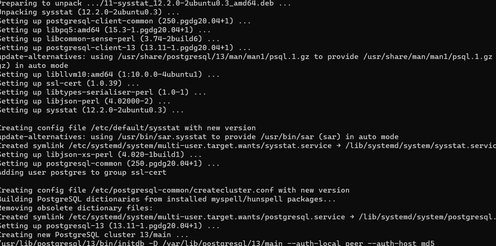
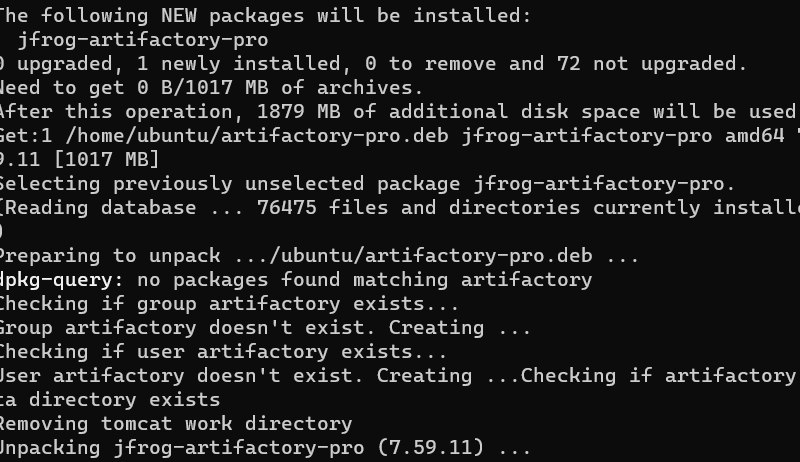

## Continuous Integration with Jenkins | Ansible | Sonarqube | PHP

[]Launch Jenkins instance

`ssh -i "MyKey.pem" ubuntu@ec2-3-141-202-221.us-east-2.compute.amazonaws.com`

[] Local key
/var/lib/jenkins/secrets/initialAdminPassword

[]Install sonarqube

-Install Java OpenJDK

`sudo apt install openjdk-11-jdk`

-Increase the virtual memory

`sudo sysctl -w vm.max_map_count=524288`

`sudo sysctl -w fs.file-max=131072`

`ulimit -n 131072`

`ulimit -u 8192`

-Reboot

`reboot`

[] Create a Dedicated user for Sonarqube

`sudo adduser --system --no-create-home --group --disabled-login sonarh2s`

[]Install PostgreSQL Database

-Add GPG Key

`wget -q https://www.postgresql.org/media/keys/ACCC4CF8.asc -O- | sudo apt-key add -`

-Add Repo

`echo "deb [arch=amd64] http://apt.postgresql.org/pub/repos/apt/ focal-pgdg main" | sudo tee /etc/apt/sources.list.d/postgresql.list`

-Run system update

`sudo apt update`

-Install PostgreSQL 13

`sudo apt install postgresql-13`

-Check status

`sudo systemctl status postgresql`

[] Create a database for Sonar

-Set password as postgre

`sudo passwd postgres`

[]Switch to postgres the user

`su - postgres`

-Set inbound rule for postgresql in instance security

[]Install artifactory on ubuntu

-Get package

`wget -O artifactory-pro.deb "https://releases.jfrog.io/artifactory/artifactory-pro-debs/pool/jfrog-artifactory-pro/jfrog-artifactory-pro-[RELEASE].deb"`

-install artifactory

`sudo apt install ./artifactory-pro.deb -y`

-start the service

`sudo systemctl start artifactory.service`

### Configure  Ansible for Jenkins Deployment

1. Navigate to Jenkins URL

[http://3.15.201.128:8080/]

[]Webhook
[https://github.com/J-Raji/Project14/settings/hooks/419307354]

2. Install & Open Blue Ocean Jenkins

3. Create a new pipeline

4. Select Github

5. Connect Jenkins with Github

6. Login to Github & Generate an access token

7. Copy Access token

8. Paste the token and connect

9. Create a new Pipeline

[] Create our Jenkinsfile
`mkdir deploy & cd deploy`

[] Create Jenkinsfile 

`sudo vi jenkinsfile`

[]  Add the code

``
pipeline {
    agent any

  stages {
    stage('Build') {
      steps {
        script {
          sh 'echo "Building Stage"'
        }
      }
    }
    }
}

``

[] Go back into the Ansible pipeline in Jenkins and configure

[] Scroll down to Build Configuration section and specify the location of the Jenkinsfile at deploy/jenkinsfile

[]Back to the pipeline again, this time click "Build now"

-[] Recommended to trigger the build again to appreciate and feel the diffence of Cloud Blue UI

1. Click on Blue Ocean

2. Select your project

3. Click on the play button against the Branch

-[] See the action

1. Create a new git branch and name it feature/jenkinspipeline-stages

2. Add another stage called Test to the Build stage

``
  pipeline {
    agent any

  stages {
    stage('Build') {
      steps {
        script {
          sh 'echo "Building Stage"'
        }
      }
    }

    stage('Test') {
      steps {
        script {
          sh 'echo "Testing Stage"'
        }
      }
    }
    }
}

``

4. Jenkins to scan the repository

    1. Click on the "Administration" button

    2. Navigate to the Ansible project and click on "Scan repository now"

    3. Refresh page and both branches will start building automatically. You can go into Blues Ocean and see both branches there too.

    4. In Blue Ocean, you can now see  how the Jenkinsfile has caused a new step in the pipeline launch build for the new branch